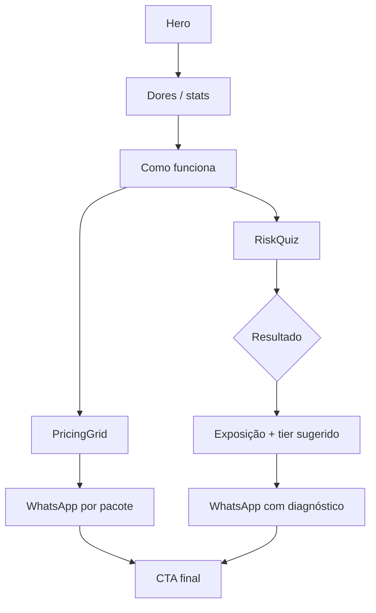

# F-MS · Design — Landing Micro SaaS Seguro

## Architecture Overview

```
/micro-saas (Astro static)
├── Hero, Dores, Como funciona     → Astro + CSS tokens
├── RiskQuiz                       → React island (client:visible)
│   ├── quiz-questions.ts          → dados declarativos (lib/micro-saas/)
│   ├── risk-calculator.ts         → score + exposição BRL + tier
│   └── whatsapp.ts                → buildWaLink(message)
├── PricingGrid                    → Astro + pricing.ts
└── CTA final                      → WhatsAppButton.astro
```

## Page Flow



## Risk Calculator Model

Estimativa educativa — não substitui auditoria.

**Inputs (pesos):**

| Fator | Impacto no score |
|---|---|
| Usuários ativos | escala logarítmica |
| MRR | base para exposição financeira |
| Tipos de dados (PII, pagamento, saúde) | +15–30 pts cada |
| Controles ausentes (MFA, backup, encrypt) | +10–20 pts cada |
| Compliance gap | +10–25 pts |
| Incidente recente | ×1.5 multiplicador exposição |

**Outputs:**

- `riskScore`: 0–100
- `riskLevel`: baixo | médio | alto | crítico
- `annualExposureBRL`: MRR × 12 × multiplier (cap e floor aplicados)
- `recommendedTier`: diagnóstico | sprint | guardião

**Tier mapping:**

| Score | Tier sugerido |
|---|---|
| 0–35 | Diagnóstico Express |
| 36–65 | Hardening Sprint |
| 66+ | Guardião Mensal |

## Pricing Tiers

| Tier | Preço | Entregáveis |
|---|---|---|
| Diagnóstico Express | R$ 1.490 | Audit 2h, relatório PDF, plano 30 dias |
| Hardening Sprint | R$ 4.900 | 1 semana hands-on: auth, secrets, backups, LGPD |
| Guardião Mensal | R$ 1.200/mês | Revisões mensais, dependabot review, IR playbook |

## WhatsApp Integration

- Env var: `PUBLIC_WHATSAPP_NUMBER` (E.164 sem `+`, ex: `5511999999999`)
- URL: `https://wa.me/{number}?text={encodeURIComponent(msg)}`
- Mensagem template pós-quiz inclui: produto, usuários, MRR, dados, score, exposição, pacote

## Components

| Component | Type | Hydration |
|---|---|---|
| `RiskQuiz.tsx` | React | `client:visible` |
| `PricingGrid.astro` | Astro | — |
| `WhatsAppButton.astro` | Astro | — |

## Styles

- Novo `src/styles/micro-saas.css` importado via `global.css`
- Reutiliza `.encodere-section`, `.encodere-form`, tokens `--space-*`, `--encodere-violet`
- Quiz: card com borda, progress bar cyan, resultado com cor por nível de risco

## Config

```env
PUBLIC_WHATSAPP_NUMBER=5511999999999
```
